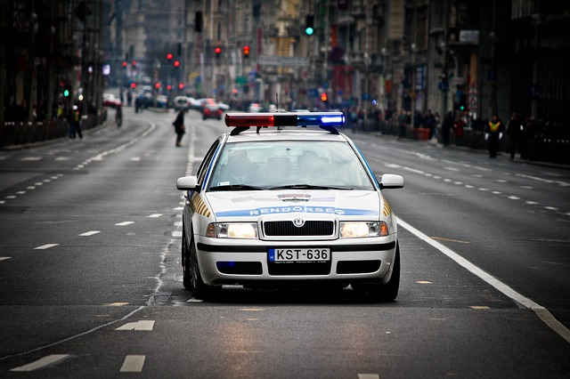
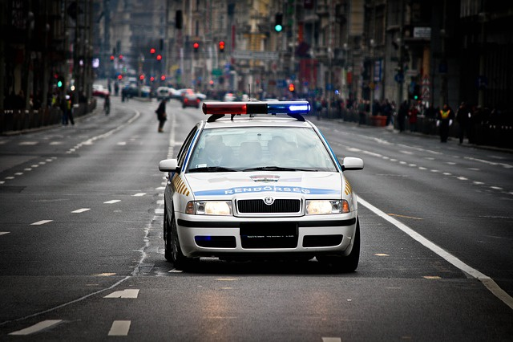

# License-Plate-Censor
This is a simple tool based on [OpenALPR](https://github.com/openalpr/openalpr) to censor license plates of vehicles in images. Many a time, people take 
videos of incidents that occur on the road and would like to upload it to social media for all to see. But sometimes, license plate numbers are shown in 
these videos and and the owner of the video would like to censor the license plate. However, most of the time this is done manually in video editing softwares, 
which can be time consuming. Hence, this simple tool can help to automatically detect and censor (blur) the license plate.




Currently, this project only supports the censoring of license plates in images but support for video is currently under development. If you would like to 
contribute to this project, please fork this repo, add new features and give me a pull request! See below for more details.


# Usage
You must have [OpenCV](http://opencv.org/downloads.html) 2.4.8+, [OpenALPR](https://github.com/openalpr/openalpr/wiki) and 
[Tesseract 3.0.3+](https://github.com/tesseract-ocr/tesseract/wiki) (not used but required for OpenALPR to work) on your system.

For Windows users, it is recommended you install OpenALPR from [here](https://github.com/openalpr/openalpr/releases) 
and it should not take longer than 10 minutes to set up. 

After installing the necessary tools, clone this repo to your local directory. Run  
`python censor_plate.py FILEDIRECTORY`  

For example, a valid command would be  `python censor_plate.py test_images/pic1.jpg`  
The program will then run and censor the license plate. A file pic1_plate_censor.jpg will be created depicting the censored plate.  
*Note: The runtime_data folder and the openalpr.conf file are required in the same directory as this project to use the OpenALPR API.*


# How it works
The analyzed_file variable contains a dict of image related statistics.
```python
analyzed_file = alpr.recognize_file(filepath)
```
For example, printing the contents of the analyzed_file dict yields:
```
{u'data_type': u'alpr_results', u'epoch_time': 1456311654000L, u'img_height': 426, u'img_width': 640, 
u'results': [{u'plate': u'KST636', u'confidence': 86.314964, u'region_confidence': 0, u'region': u'', u'plate_index': 0, u'processing_time_ms': 1.8684, 
u'candidates': [{u'matches_template': 0, u'plate': u'KST636', u'confidence': 86.314964}], 
u'coordinates': [{u'y': 279, u'x': 299}, {u'y': 279, u'x': 369}, 
{u'y': 292, u'x': 369}, {u'y': 292, u'x': 299}], 
u'matches_template': 0, u'requested_topn': 1}], u'version': 2, u'processing_time_ms': 37.9473, u'regions_of_interest': []}
```
Hence, we can see that the 'results' key of the analyzed_file dict contains the 'coordinates' of the detected plate on the picture.
Moreover, to draw a rectangle in OpenCV, it only requires the coordinates of the opposite corners of the rectangle. A new image with
the censored license plate is then created.
```python
#x,y coordinates of opposite corners of license plate
x1 = results['results'][0]['coordinates'][0]['x']
y1 = results['results'][0]['coordinates'][0]['y']
x3 = results['results'][0]['coordinates'][2]['x']
y3 = results['results'][0]['coordinates'][2]['y']

cv2.rectangle(img,(x1,y1),(x3,y3),(0,0,0),-1)
cv2.imwrite(filepath.partition(".")[0]+"_plate_censor.jpg",img)
```


# Issues faced
The [OpenALPR docs](http://doc.openalpr.com/) contain very limited use of the API and some features require a commercial license.
While the docs say video processing is supported on the command line (eg: alpr -c US video.mp4), it is not clear how to analyze videos through
the ALPR API and all attempts so far have not succeeded.


# Current development
Given the above issues, I have 2 proposals:

**1. Break video in images**  
We can split a video into its component images and run this script for each frame. However, this is computationally 
very expensive given that there are around 10-30 frames in 1 second of video.

**2. Track image after detection**  
Typing `alpr videofile.mp4` in the command line seems to report the frame in which
the first instance of the license plate is detected.
We could then extract that particular frame and identify the license plate region and track it using OpenCV.


# Contribution
If anyone has any insight on the ALPR API related to video processing, please give me a pull request depicting its basic use
or create a new issue with the heading "Feature Request: Video Processing" and provide me with tips to handle videos. All contributions 
are greatly appreciated.


